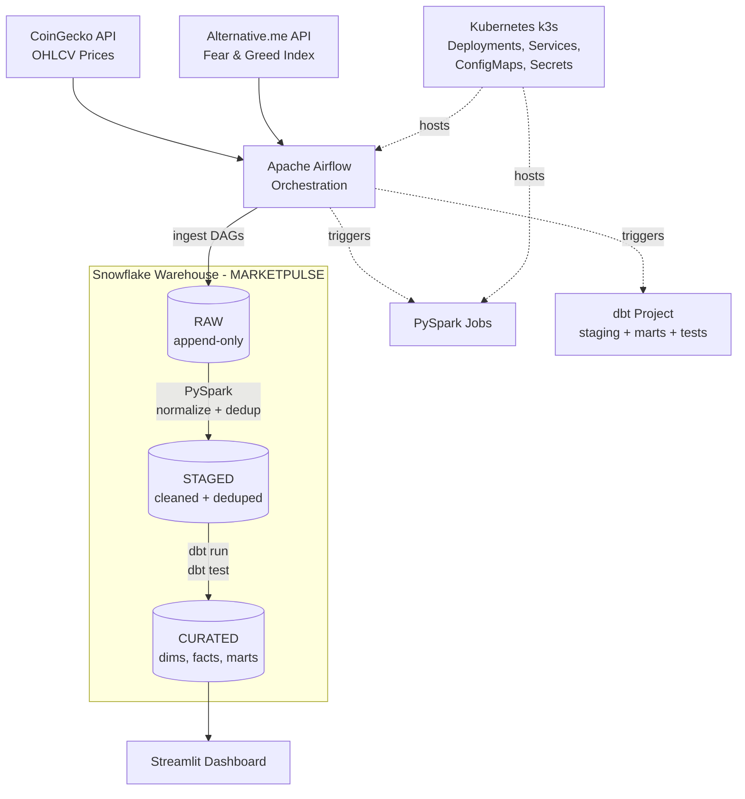

# MarketPulse Data Platform

> Crypto market data platform with **Airflow** orchestration, **PySpark** processing, **dbt** transformations, and **Snowflake** medallion architecture (RAW → STAGED → CURATED), deployable to **Kubernetes (k3s)** and served via a **Streamlit** dashboard.

A production-style data engineering pipeline demonstrating medallion architecture, incremental processing, idempotent orchestration, and distributed feature computation across a multi-source crypto dataset.

---

## Architecture



**Data flow:** APIs → Airflow ingests → Snowflake RAW (append-only) → PySpark normalizes + dedups → Snowflake STAGED → dbt builds + tests → Snowflake CURATED → Streamlit dashboard.

---

## Demo

### Streamlit Dashboard — Price & Volatility Trends


Connected to Snowflake's `CURATED` layer, showing market analytics across 10 crypto assets with interactive multi-asset time series and 30-day rolling volatility.

### Volatility Regime Timeline & Fear & Greed Correlation


Color-coded daily regime classification (LOW / NORMAL / HIGH / EXTREME) per asset, alongside Fear & Greed Index vs daily returns scatter.

### Max Drawdown Comparison


30-day max drawdown comparison across tracked assets, revealing relative risk exposure.

---

## Tech Stack

| Layer | Technology |
|---|---|
| **Warehouse** | **Snowflake** (medallion: RAW → STAGED → CURATED) |
| Orchestration | Apache Airflow |
| Distributed Processing | Apache Spark (PySpark) |
| Transformation & Testing | dbt (dbt-snowflake) |
| Dashboard | Streamlit + Plotly |
| Containerization | Docker Compose |
| Deployment | Kubernetes (k3s), plain manifests |
| Language | Python, SQL |

---

## What This Pipeline Does

1. **Ingestion** — Pulls daily OHLCV data from CoinGecko for 10 crypto assets and daily Fear & Greed Index from Alternative.me. Lands in **Snowflake `RAW`** schema as append-only tables with `_ingested_at` and `_batch_id` metadata for lineage.

2. **Processing (PySpark)** — Normalizes schemas, casts types, deduplicates on `(asset_id, date)` using `ROW_NUMBER()` windowing, filters invalid records, computes derived features (returns, log returns, rolling volatility, drawdowns). Writes to **Snowflake `STAGED`**.

3. **Modeling (dbt)** — Builds `dim_asset`, `fact_market_daily`, and `mart_volatility` in the **Snowflake `CURATED`** layer via a dbt project with schema and singular data tests. Features volatility regime classification (LOW / NORMAL / HIGH / EXTREME).

4. **Quality Gates** — Null checks, duplicate detection, freshness validation, and volume anomaly detection run between pipeline stages as Airflow tasks.

5. **Consumption** — Streamlit dashboard connects directly to **Snowflake** and visualizes price trends, rolling volatility, regime timelines, Fear & Greed correlation, and max drawdown comparison.

---

## Snowflake Warehouse Schema

The warehouse follows a **medallion architecture** across three schemas:

### `RAW` schema (append-only)
- `raw_prices` — OHLCV data per asset per day, raw from CoinGecko
- `raw_sentiment` — Daily Fear & Greed index from Alternative.me

### `STAGED` schema (cleaned + deduplicated)
- `stg_prices` — Normalized prices with UTC timestamps, one row per `(asset_id, date)`
- `stg_sentiment` — Cleaned sentiment scores, one row per date

### `CURATED` schema (business-ready)
- `dim_asset` — Asset dimension with `first_seen_date`, `last_seen_date`
- `fact_market_daily` — Daily price, volume, returns, volatility metrics per asset
- `mart_volatility` — Analytics view with rolling 7d/30d volatility, 30d max drawdown, and regime classification

---

## Data Volume

Current pipeline run (Snowflake):

| Table | Records |
|---|---|
| `RAW.raw_prices` | 6,966 |
| `RAW.raw_sentiment` | 730 |
| `STAGED.stg_prices` (deduped) | 3,473 |
| `STAGED.stg_sentiment` | 365 |
| `CURATED.fact_market_daily` | 3,473 |
| `CURATED.mart_volatility` | 3,473 |

10 assets × 365 days of historical data, with dedup reducing RAW→STAGED by ~50% on reprocessed data — demonstrates the dedup logic working correctly.

**Volatility regime distribution:**

| Regime | Count |
|---|---|
| NORMAL | 2,605 |
| HIGH | 583 |
| LOW | 236 |
| EXTREME | 29 |

---

## Project Structure

```
marketpulse-data-platform/
├── dags/                        # Airflow DAG definitions
│   ├── dag_ingest_prices.py
│   ├── dag_ingest_sentiment.py
│   ├── dag_transform_dbt.py     # dbt run + dbt test orchestration
│   ├── dag_quality_checks.py
│   └── utils/dbt_commands.py    # Testable dbt command builder
├── spark_jobs/                  # PySpark processing jobs
│   ├── process_prices.py        # Normalize + dedup prices
│   ├── process_sentiment.py     # Clean sentiment data
│   ├── compute_features.py      # Rolling volatility + drawdowns
│   └── run_local.py             # End-to-end Spark runner
├── sql/                         # Snowflake schema + queries
│   ├── 01_schemas.sql           # RAW, STAGED, CURATED schemas
│   ├── 02_raw_tables.sql
│   ├── 03_staged_tables.sql
│   ├── 04_curated_tables.sql    # Facts, dims, marts
│   └── 05_quality_checks.sql
├── dbt/                         # dbt project (STAGED → CURATED)
│   ├── dbt_project.yml
│   ├── profiles.yml             # Env-var driven, no credentials
│   ├── macros/
│   ├── models/staging/          # Views over Spark STAGED tables
│   ├── models/marts/            # dim_asset, fact_market_daily, mart_volatility
│   └── tests/                   # Singular data tests
├── k8s/                         # Kubernetes (k3s) manifests
├── scripts/
│   └── setup_snowflake.sql      # Idempotent trial-account provisioning
├── streamlit_app/               # Snowflake-connected dashboard
│   └── app.py
├── docker/                      # Local dev environment
│   ├── docker-compose.yml
│   ├── Dockerfile.airflow
│   └── Dockerfile.spark
├── tests/                       # Unit tests for transforms
├── docs/                        # Architecture decisions + images
├── config/                      # Settings template
├── load_data.py                 # Standalone data loader
├── Makefile                     # k3d/k3s build, deploy, teardown
├── .env.example                 # Snowflake credential template
└── requirements.txt
```

---

## Design Decisions

| Decision | Rationale |
|---|---|
| **Snowflake medallion architecture** (RAW / STAGED / CURATED) | Clear data lineage, reprocessability, separates raw ingestion from business logic |
| PySpark for heavy transforms | Demonstrates distributed processing patterns; dedup, normalization, and rolling aggregations scale to larger datasets |
| **dbt for STAGED → CURATED** | Replaces hand-rolled stored procedures with versioned, tested, documented SQL models; lineage and tests come for free |
| Append-only RAW + dedup-on-load | Makes pipeline idempotent — reruns don't create duplicates in downstream layers |
| Batch metadata (`_batch_id`, `_ingested_at`) | Enables lineage tracing and time-travel debugging |
| Quality gates between layers | Blocks bad data from propagating; fails fast on schema drift or anomalies |

---

## Testing

31 unit tests: 23 covering core transform logic (return computation, drawdown calculation, volatility regime classification, deduplication) plus 8 covering the dbt command builder used by the transformation DAG. All passing.

```bash
pytest tests/ -v
```

```
============================== 31 passed in 0.04s ==============================
```

The dbt project additionally ships schema tests (`unique`, `not_null`, `accepted_values`, `relationships`) and singular data tests (non-negative prices, no future dates, Fear & Greed bounded 0-100, fact-table grain uniqueness), executed with `dbt test`.

---

## Getting Started

### Prerequisites
- Python 3.10+
- Snowflake account (free trial works)
- Docker (optional, for Airflow/Spark containers)

### Setup

```bash
# 1. Clone the repo
git clone https://github.com/<your-username>/marketpulse-data-platform.git
cd marketpulse-data-platform

# 2. Create virtualenv and install dependencies
python -m venv venv
source venv/bin/activate
pip install -r requirements.txt

# 3. Initialize Snowflake schemas
# Run scripts/setup_snowflake.sql in a Snowsight worksheet (idempotent,
# provisions warehouse + database + all schemas/tables from scratch)

# 4. Configure credentials
cp config/settings.example.py config/settings.py
# Edit config/settings.py with your Snowflake credentials
cp .env.example .env
# Edit .env — used by dbt and docker-compose

# 5. Run the pipeline
python load_data.py              # Standalone: API → Snowflake full pipeline
python spark_jobs/run_local.py   # Spark-based processing layer

# 6. Launch dashboard
streamlit run streamlit_app/app.py
```

### Airflow (optional)

```bash
cd docker
docker-compose up -d
# Airflow UI: http://localhost:8080 (admin/admin)
```

---

## dbt Transformations

The STAGED → CURATED layer is owned by a dbt project in `dbt/` (dbt-snowflake adapter). It migrates the stored procedures from `sql/04_curated_tables.sql` into version-controlled, tested models:

| Model | Materialization | Schema | Description |
|---|---|---|---|
| `stg_market_prices` | view | STAGED | Thin contract over Spark-produced `stg_prices` |
| `stg_market_sentiment` | view | STAGED | Thin contract over Spark-produced `stg_sentiment` |
| `dim_asset` | table | CURATED | Asset dimension (one row per tracked asset) |
| `fact_market_daily` | table | CURATED | Daily OHLCV + derived returns + Fear & Greed |
| `mart_volatility` | view | CURATED | Rolling 7d/30d volatility, drawdown, regime |

Object names and columns match the previous SQL DDL, so the Streamlit dashboard works unchanged.

**Credentials** come exclusively from environment variables (`dbt/profiles.yml` uses `env_var()`). Copy `.env.example` to `.env`, fill it in, then:

```bash
pip install dbt-core dbt-snowflake
set -a && source .env && set +a

dbt debug --project-dir dbt --profiles-dir dbt   # verify connection
dbt run   --project-dir dbt --profiles-dir dbt   # build CURATED
dbt test  --project-dir dbt --profiles-dir dbt   # schema + singular tests
```

**Orchestration:** the `marketpulse_transform_dbt` DAG runs `dbt run` then `dbt test` daily at 07:30 UTC via `BashOperator` — after both ingestion DAGs (06:00, 06:30) and before the quality-checks DAG (08:00). The dbt CLI is installed in the Airflow image inside an isolated virtualenv to avoid dependency conflicts.

**Fresh Snowflake account?** Run `scripts/setup_snowflake.sql` first — it idempotently provisions the warehouse, database, schemas, and tables the pipeline expects.

---

## Kubernetes Deployment (k3s)

Plain Kubernetes manifests (no Helm) in `k8s/` deploy the pipeline services onto a local k3s cluster: Postgres (Airflow metadata), an Airflow init `Job`, webserver + scheduler `Deployments`, and a standalone Spark master/worker pair. Configuration is split into a `ConfigMap` (non-secret) and a `Secret` (credentials, committed only as a placeholder template).

```bash
# One-time: install k3d, kubectl (see Makefile header for plain k3s)
make cluster                                     # local k3s-in-Docker cluster
make build                                       # build Airflow + Spark images
make import                                      # import images into the cluster

cp k8s/02-secret.template.yaml k8s/02-secret.yaml
# edit k8s/02-secret.yaml — replace every CHANGE_ME

make deploy                                      # apply manifests in order
make status                                      # pods / services / jobs
# Airflow UI: http://localhost:30080 (admin/admin)

make teardown                                    # delete the namespace
make destroy                                     # delete the whole cluster
```

Notes:
- Images use `imagePullPolicy: Never` — they are built locally and imported into the cluster, never pulled from a registry.
- The Airflow UI is exposed via `NodePort` 30080 (simplest option without an Ingress controller).
- `k8s/02-secret.yaml` (the filled-in copy) is gitignored.

---

## Trade-offs & Scaling

| Choice | Trade-off |
|---|---|
| `OVERWRITE` mode in Spark → Snowflake STAGED | Simpler than incremental MERGE for this volume; production would use MERGE for larger tables |
| Single Spark worker | Sufficient for 3.5K records; scales by adding workers in Docker Compose |
| CoinGecko free tier | Rate-limited (~10 req/min); acceptable for daily batch |
| Daily batch frequency | Matches sentiment data cadence; switch to hourly DAGs for near-real-time |

### To Scale to Production
- ~~Migrate mart layer to **dbt** for lineage + testing~~ — done, see [dbt Transformations](#dbt-transformations)
- ~~Container orchestration~~ — done for local k3s, see [Kubernetes Deployment](#kubernetes-deployment-k3s)
- Swap Docker Compose for **EMR / Dataproc** with cluster mode Spark
- Add **Kafka / Kinesis** ingestion for real-time tick data

---

## Future Work

- Exchange trade data (Binance API) for liquidity mart
- CI/CD with GitHub Actions
- Cloud deployment with scheduled runs

---
